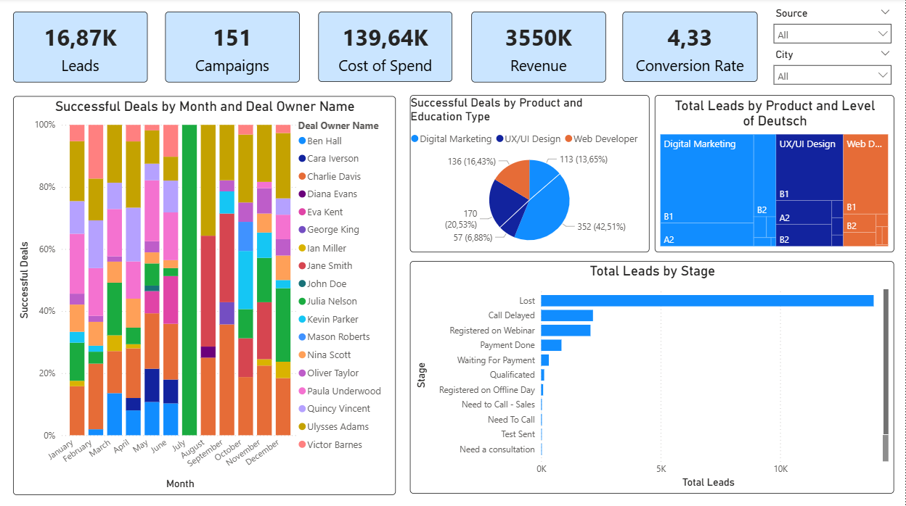

# CRM Data Analysis: Marketing & Sales Efficiency for an Online Coding School

🔗 [github.com/YeHra/crm-unit-economics-ab-testing](https://github.com/YeHra/crm-unit-economics-ab-testing)

An end-to-end data analytics project covering CRM data cleaning, exploratory analysis, unit economics, and A/B test design for a German online coding school — aimed at identifying growth points in marketing and sales.

## 🎯 Objective

The company collects lead, call, deal, and ad-spend data in its CRM but doesn't use it systematically for decisions. The project covers:
- cleaning and merging fragmented data sources (contacts, calls, deals, ad spend);
- finding growth opportunities in marketing, sales, and product performance;
- calculating unit economics per product and selecting the metric to test;
- designing and justifying an A/B test;
- building a dashboard with key KPIs for ongoing monitoring.

## 🛠 Tech Stack

`Python` (pandas, numpy, plotly, geopandas, folium) · `Google Colab` · `Power BI Desktop` · `Excel` (openpyxl) · `Parquet` / `XLSX` / `JSON`

## 📁 Repository Structure

```
project/
├── README.md
├── requirements.txt
├── data/
│   ├── raw/                       # source data
│   │   ├── calls_raw.xlsx
│   │   ├── spend_raw.xlsx
│   │   ├── deals_raw.xlsx
│   │   ├── contacts_raw.xlsx
│   │   ├── city_data_google_en.json
│   │   └── deutsch_level_dict.json
│   └── processed/                 # cleaned data, two formats for two purposes
│       ├── calls_clean.parquet    # used by 02_analysis.ipynb
│       ├── spend_clean.parquet
│       ├── deals_clean.parquet
│       ├── contacts_clean.parquet
│       ├── deals_clean.xlsx       # used by the Power BI dashboard
│       └── spend_clean.xlsx
├── notebooks/
│   ├── 01_data_cleaning.ipynb     # data cleaning and preparation
│   └── 02_analysis.ipynb          # exploratory analysis and visualizations
├── unit_economics/
│   └── unit_economic.xlsx         # unit economics and A/B test sample-size calc
├── dashboard/
│   ├── dashboard.pbix
│   └── screenshots/
│       └── dashboard_overview.png
└── presentation/
    └── data_cleaning_and_analysis.pdf
```

## 🧹 Data Cleaning Pipeline (`01_data_cleaning.ipynb`)

- Type conversion (`Created Time`, `Closing Date`, `Call Start Time`, `Date`) to `datetime`.
- Deduplication: both full-row duplicates and duplicates on a meaningful column subset (e.g. calls deduplicated by start time, owner, duration, and status).
- Cleaning currency fields (stripping `€`) and casting to `float`.
- Fixing logical inconsistencies: deals where `Created Time` is later than `Closing Date`, or `Initial Amount Paid` exceeds `Offer Total Amount`.
- Removing technical/test records (`Source == 'Test'`, campaigns with zero impressions/clicks/spend).
- Filling missing `City` and `Level of Deutsch` values via the mode per contact, and enriching city data with coordinates/metadata from `city_data_google_en.json`.
- Winsorizing outliers — the top 0.5% of `SLA Minutes` values capped at the 99.5th percentile.
- Normalizing mixed-type columns (e.g. boolean/empty `Scheduled in CRM` mapped to `Yes` / `No` / `Unknown`) to satisfy Parquet's single-dtype-per-column requirement.
- Filling remaining categorical gaps with `Unknown`.
- Output: 4 cleaned datasets saved as `.parquet` for analysis, plus `.xlsx` exports of `deals` and `spend` for the Power BI dashboard.

## 📊 Key Findings (`02_analysis.ipynb`)

**Time series.** The relationship between call volume and closed deals over time is weak — the trend lines diverge, with calls growing faster than closed deals. Only 4% of all processed deals reach `Payment Done`, and successful deals take more than twice as long to close as the average deal.

**Campaign efficiency.** Of 158 campaigns: 24 had spend but no revenue, 26 had both spend and revenue, and 40 generated revenue with no recorded spend (organic/legacy campaigns). Five relaunch candidates were identified by revenue-to-spend ratio:

| Campaign | Revenue | Spend |
|---|---|---|
| performancemax_digitalmarkt_ru_DE | €106,000 | €0 |
| Dis_DE | €23,700 | €0 |
| 07.07.23LAL_DE | €46,650 | €4,035 |
| 02.07.23wide_DE | €63,250 | €6,700 |
| brand_search_eng_DE | €29,250 | €3,458 |

**Sales team efficiency.** Manager-level metrics cluster around a ~5% conversion rate and ~€1,000 average deal cost. Two notable outliers:
- Oliver Taylor — 31.25% conversion rate at a €1,005 average deal cost (a practice worth replicating);
- Cara Iverson — 2.59% conversion rate at a €5,750 average deal cost (a case worth coaching/review).

No statistically significant relationship was found between the number of deals a manager handles and their conversion rate — scaling lead volume alone doesn't substitute for deal quality.

**Payments & products.** `One Payment` has the best conversion rate and the highest average order value. The most in-demand product is Digital Marketing (highest deal count and total revenue); UX/UI Design has half the deal volume but a higher average order value.

**Geo analysis.** The bulk of deals are concentrated in Germany, and successful deals are almost entirely within its borders, with clear clusters around major cities.

## 📈 Power BI Dashboard



The dashboard consolidates key KPIs — leads, campaigns, spend, revenue, conversion rate, successful deals by month and owner, product mix by education type and German-level segment, and lead distribution by stage — with `Source` and `City` filters for ongoing, self-serve monitoring without querying raw data directly.

## 💰 Unit Economics (`unit_economics/unit_economic.xlsx`)

Calculated for three core products: **Web Developer**, **Digital Marketing**, **UX/UI Design**.

| Metric | Web Developer | Digital Marketing | UX/UI Design | Total |
|---|---|---|---|---|
| Leads (UA) | 16,868 | 16,868 | 16,868 | 16,868 |
| Customers (B) | 135 | 468 | 225 | 839 |
| Conversion C1 | 0.80% | 2.77% | 1.33% | 4.97% |
| CPA, € | 8.28 | 8.28 | 8.28 | 8.28 |
| Revenue, € | 364,580 | 2,244,320 | 940,475 | 3,549,375 |
| Average order value (AOV), € | 730.62 | 776.58 | 810.06 | 780.08 |
| LTV per lead, € | 21.61 | 133.05 | 55.75 | 210.42 |
| Contribution margin (CM), € | 224,944.62 | 2,104,684.62 | 800,839.62 | 3,409,739.62 |

**Sensitivity finding:** a 10% improvement in C1, AOV, or APC yields an identical profit uplift, but improving C1 is the cheapest to achieve — it was selected as the growth lever and the subject of the A/B test.

## 🧪 A/B Testing

Two hypotheses test a change to the call script (adding a sentence about evening courses in a specific track) with an expected 30% relative lift in conversion.

| Hypothesis | Track | Baseline conversion | Group size | Groups | Duration |
|---|---|---|---|---|---|
| #1 | Web Development | 5% | 3,378 people | 2 | 34 days |
| #2 | UI Design | 8% | 2,044 people | 2 | 21 days |

Sample size calculated as `n = 16 × (1−p) / (p × effect²)`; test duration derived from average daily call volume.

## 🚀 How to Reproduce

1. Install dependencies: `pip install -r requirements.txt`.
2. Open `notebooks/01_data_cleaning.ipynb` in Google Colab — reads raw data directly from this repository's GitHub raw links (`RAW_BASE`), cleans it, and saves the result as `.parquet` (for analysis) and `.xlsx` (for the dashboard).
3. Open `notebooks/02_analysis.ipynb` — reads the cleaned `.parquet` files via `PROCESSED_BASE` and reproduces all charts and breakdowns described above.
4. The repository must be **public** for the raw GitHub links to resolve.
5. `unit_economics/unit_economic.xlsx` — open and recalculate in Excel/LibreOffice; all formulas are preserved.
6. `dashboard/dashboard.pbix` — requires [Power BI Desktop](https://www.microsoft.com/en-us/power-platform/products/power-bi/desktop) (free) to open and refresh; for a quick look without installing anything, see the screenshot above.

## 📌 About the Data

The dataset is anonymized CRM data (sourced from Kaggle) and contains no real customer personal data.

---

*Coursework project (dataset and scenario provided by the curriculum, German language required); some CRM fields mix Russian/English from the original ad campaigns; AI tools (DeepSeek, Claude) assisted with debugging, visualization choices, and this README — all analysis and conclusions are the author's own.*

---

*Author: [Name] · [LinkedIn] · [Email]*
